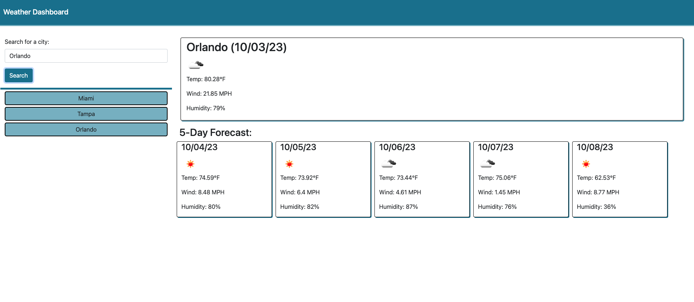

# weather-dashboard

## Description

The Weather Dashboard is an application that allows the user to search for a city and see its current and future weather conditions. The app shows the city name, date, icon for the weather conditions, temperature, wind, and humidity. Future weather conditions are presented on the page in a five-day format. Once a city has been searched, it will be added to the history section of the page by using local storage. The user can click on past entries to view that city's weather again. 

The Weather Dashboard uses javascript to dynamically update the HTML and CSS. Date data comes from Day.js and weather data comes from the OpenWeather API. 

## Usage

Access my Work Day Scheduler at [https://gfuselier.github.io/weather-dashboard](https://gfuselier.github.io/weather-dashboard)

## Credits
Tutors - Chris Baird, Bobbi Tarkany

## License
N/A